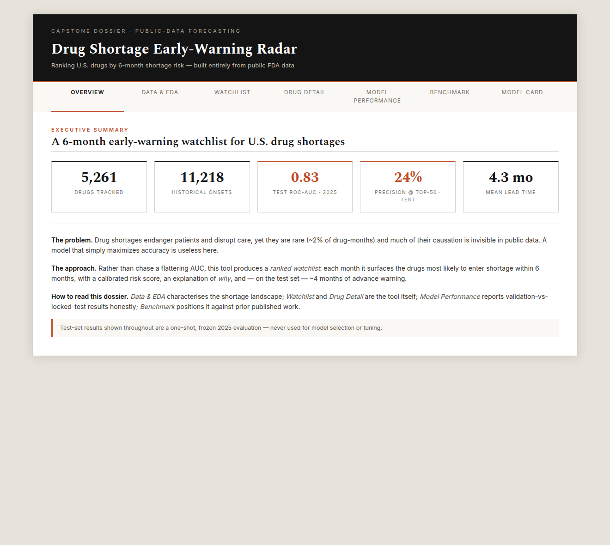
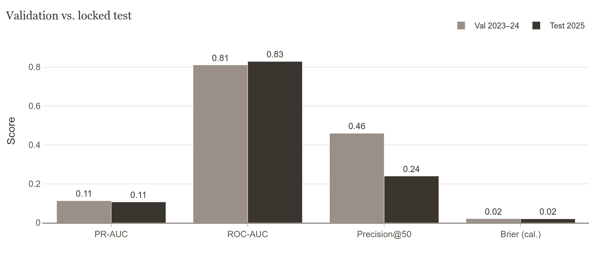
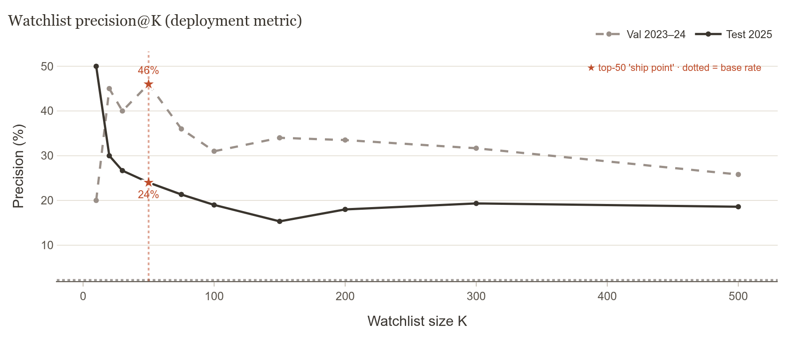
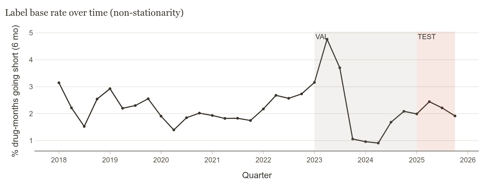
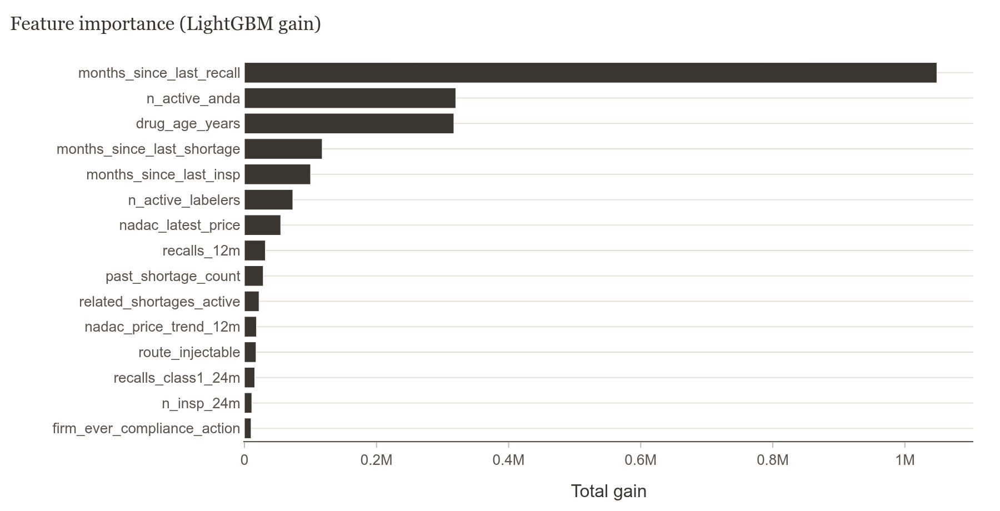
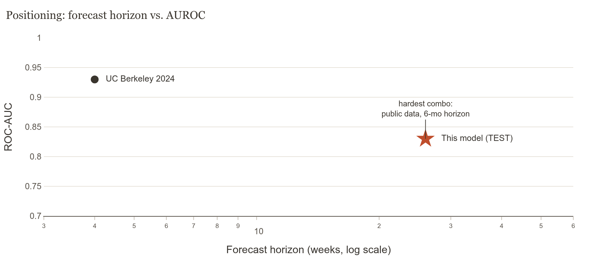

# Drug Shortage Early-Warning Radar



**An early-warning watchlist that tells a hospital pharmacy buyer which U.S. drugs are most likely to go into shortage in the next 6 months — built entirely from free, public FDA data.**

A pharmacy buyer can't react to every drug, and the FDA usually posts a shortage only *after* supply is already tight — by then you're scrambling for an alternate. Shortages are also *rare* (~2 % of drug-months) and much of their causation — private contracts, raw-material supply, demand spikes — is invisible in public data, so a model that just maximises accuracy is useless here. Instead, this project ships a **ranked watchlist**: every month it surfaces the drugs most likely to go short, each with a calibrated risk score, a SHAP explanation of *why*, and — measured on a locked future test set — roughly **four months of lead time** to qualify a second supplier, raise par levels, or flag a drug for formulary review.

### Who it's for
**Primary user — the hospital / health-system pharmacy buyer**, whose recurring question every screen answers: *"Which drugs do I act on now, and can I trust it enough to reorder?"*
*Who else this serves:* FDA / public-health analysts (where shortage risk is concentrating), wholesale & GPO planners (where to hold buffer stock or line up backup suppliers), and researchers — but it's designed first for the buyer.

---

## Headline results

Evaluated on a **locked 2025 test window** (never used for tuning — see [Honest evaluation](#honest-evaluation)):

| Metric | Validation (2023–24) | **Test (2025)** | Reading |
|---|---|---|---|
| ROC-AUC | 0.81 | **0.83** | Ranking quality — held up out-of-sample |
| PR-AUC | 0.113 | **0.107** | Low because shortages are ~2 % rare (expected) |
| **Precision @ top-50** | 0.46 | **0.24** | ~1 in 4 flagged drugs go short within 6 mo (**~11× base rate**) |
| Mean lead time | 4.3 mo | **4.3 mo** | How early the watchlist fires before onset |
| Brier (calibrated) | 0.021 | **0.020** | Risk scores are honest probabilities |

> **Why precision@K, not PR-AUC?** PR-AUC averages over the hopeless long tail of a rare-event problem. What a pharmacy team actually uses is a short watchlist. At a top-50 monthly list the model is ~11× better than chance — and the operating point is marked (★) directly on the curves below.

<p align="center">
  
  
</p>

---

## How it works

```
openFDA + Wayback ─▶ entity resolution ─▶ drug-month panel + labels ─▶ leakage-safe features
                                                                              │
                          LightGBM (+ logistic baseline) ◀────────────────────┘
                                  │
              isotonic calibration ─▶ validation report ─▶ locked-test (once) ─▶ dashboard
```

- **Data (all public, no API key):** openFDA Drug Shortages, NDC Directory, Drugs@FDA, enforcement/recalls; FDA inspections & compliance; CMS NADAC prices. Historical shortage labels are reconstructed from **Wayback Machine** snapshots of the FDA shortage pages (the live endpoint only keeps a current snapshot).
- **Panel & labels:** a monthly panel of ~5,300 drugs (`generic|route`). `y = 1` if a *new* shortage onset begins within 6 months; months already in shortage are excluded (we predict new onsets, not ongoing ones). Combination drugs are matched order-independently (token-set) so e.g. Adderall's four salts link despite differing name order across sources.
- **Features (as-of month *t*, leakage-safe):** market structure (active labelers, HHI, generic status), manufacturing risk (inspection classifications, recalls), price pressure (NADAC), and dynamic recency signals (`months_since_last_recall`, `months_since_last_shortage`, cross-form supply stress). Recency/dynamic features dominate — the model keys on *timing*, not static drug attributes.
- **Model:** LightGBM with forward-chaining time-series CV, a fixed CV-derived tree count (no early-stopping on validation), and regularisation tuned to close the train/val gap. **Isotonic calibration** makes the displayed risk a genuine probability.

<p align="center">
  
  
</p>

---

## The dashboard

A clean, report-style Dash app (`python app.py` → http://127.0.0.1:8050) with seven tabs:

Each tab is a section of the buyer's brief, answering one of their questions:

| Tab | Section | The buyer's question it answers |
|---|---|---|
| **Overview** | Where to focus this month | *"Where do I focus — and can I trust it?"* |
| **Data & EDA** | The shortage landscape | *"What goes short, and why?"* |
| **Watchlist** | Drugs to act on | *"Which drugs should I act on right now?"* |
| **Drug Detail** | Drug risk profile | *"Should I act on **this** drug — and why?"* |
| **Model Performance** | How far to trust the list | *"How much should I trust it before I reorder?"* |
| **Benchmark** | How it compares | *"Better than waiting for the FDA to post?"* |
| **Model Card** | Method & limits | *"What are the limits before I rely on it?"* |

---

## How this compares to prior work

No published study reports precision@K at a multi-month horizon, so there is no perfectly matched benchmark — the fair comparison is AUROC, and this project runs the **hardest combination**: public-only data at a 6-month horizon.

<p align="center"></p>

| Study | Data | Horizon | Headline | Operating point |
|---|---|---|---|---|
| UC Berkeley 2024 | Public FDA (same as ours) | 4 weeks | AUROC 0.93 | recall 72 % / **precision 0.1 %** |
| Canadian XGBoost 2023 | Proprietary pharmacy sales | 1 month | accuracy 69 %, κ 0.44 | 59 % recall on severe |
| South Korea 2025 | Regulatory case reports | duration / cause | F1 > 0.70 | classifies cause, not onset |
| **This model** | Public FDA + Wayback | **6 months** | ROC-AUC 0.83 | **precision@50 = 24 %** |

A near-identical public-data peer (Berkeley) reports 0.1 % precision at 72 % recall — a high AUC that is operationally unusable. This project optimises the *usable* corner. Models with stronger headlines do it via easier near-term horizons or proprietary transaction data, not better modelling — across every study the dominant signal is prior-shortage history, so the ceiling is the **public-data feature set, not the algorithm**.

---

## Reproduce

```bash
pip install -r requirements.txt

python scripts/build_panel.py --force   # panel + leakage-safe features
python scripts/train.py                 # LightGBM + logistic, calibrated, scored
python scripts/evaluate.py              # → reports/validation.md
python scripts/build_figures.py         # → reports/figures/*.png + figures.html
python app.py                           # dashboard at http://127.0.0.1:8050

python -m pytest tests/ -q              # 42 tests (leakage, panel labels, app, figures)
```

The raw-ingest step (`scripts/run_ingest.py`) hits openFDA/Wayback/CMS; cached parquet in `data/processed/` lets everything else run fully offline.

---

## Honest evaluation

The **2025 test window is locked**: it was scored exactly once, by `scripts/eval_test_LOCKED.py`, after the model and features were final, and never used for any tuning decision. Validation (2023–24) was used for all iteration. The val→test transition is itself part of the story: ranking quality, calibration, and lead time held; the noisier precision@50 corrected from an optimistic 46 % to a trustworthy 24 % — exactly what a clean holdout should reveal. Re-running the test on a changed model would invalidate that estimate, so the model is frozen.

## Known limitations

- **Label noise:** labels are FDA *posting* dates (≈1–4 weeks after real onset) reconstructed from Wayback snapshots; ~24 % of shortage names (brand-only, or salts absent from NDC) still don't match a drug in the panel.
- **Catch-rate:** a tight top-50 monthly list catches a minority of all onsets — precise, not exhaustive.
- **Unobservable causation:** the strongest shortage signals (transaction volumes, contracts) are private; this is the real performance ceiling.
- **Triage aid, not an oracle.** False alarms can themselves distort purchasing — use alongside domain expertise.

---

## Project layout

```
app.py                  Dash dashboard (7 tabs, report theme)
config.py               splits, horizons, paths
src/
  resolve.py            entity resolution (labeler ↔ inspection firm)
  panel.py              drug-month panel + labels (token-set matching)
  features.py           leakage-safe feature engineering
  models.py             training, calibration, scoring
  evaluate.py           metrics, precision@K, lead-time analysis
  explain.py            SHAP driver breakdowns
  figures.py            18 Plotly figure-builders (report theme)
scripts/                ingest · build_panel · train · evaluate · build_figures · eval_test_LOCKED
tests/                  leakage · panel labels · app callbacks · figures  (no browser needed)
reports/                validation.md · test_LOCKED.md · figures/
```

*Built with LightGBM, scikit-learn, SHAP, Plotly Dash. Data © FDA / CMS (public domain); shortage history via the Internet Archive.*

---

*Built with assistance from [Claude Code](https://claude.com/claude-code).*
